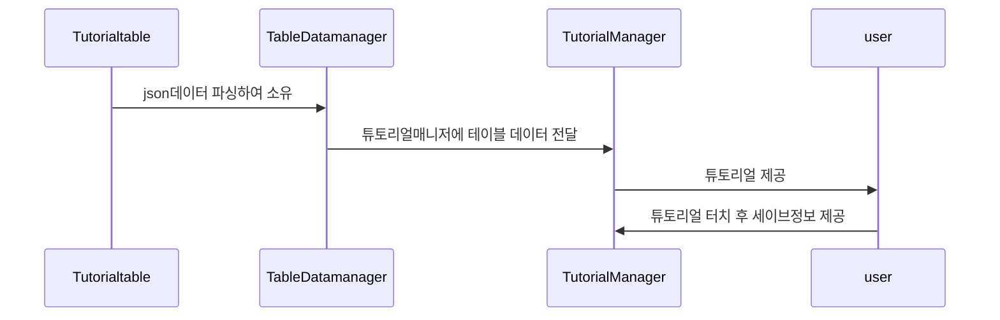

# 키우기게임 포트폴리오
- Valkirie 키우기 포트폴리오 입니다(`해당 프로젝트는 스크립트만 존재하여 플레이 진행이 되지 않습니다.`)
- 방치형게임의 핵심 로직내용이 포함되어 있습니다.
- 현재 출시되어 있으며 출시 직전까지 개발을 맡아 하였습니다. 개발인원 4명(아트디자이너1명,기획자1명,애니메이터1명,개발자1명(본인))
- [발키리 소녀 키우기](https://play.google.com/store/apps/details?id=com.HighSpirit.KnightRush):해당 링크에서 게임을 다운받아 즐겨보실수 있습니다.
- 각 목록에서 `▶ 버튼`을 눌러 코드,세부내용을 확인할수 있습니다

## Index

1. [JsonParsing](#jsonparsing)
2. [재화관리](#재화관리)
3. [미션관리](#미션관리)
4. [튜토리얼 시스템](#튜토리얼시스템)
5. [인벤토리 관리](#인벤토리관리)


## JsonParsing

### 소개 
- 각종 데이터 관리에 필요한 테이블을 json으로 관리하기에 json으로 게임에 필요한 데이터를 게임 시작시 세팅하여 사용합니다.
<details>
<summary>
    <span style="color:#008000"> JsonParsing 코드,테이블관리 내용 보기 </span>
</summary>
    <div markdown="1">
     
- json에 사용되는 엑셀 예시(미션)

| idx | name | mission_type | mission_value | reward_type | reward_count |
| --- | ---- | ------------ | ------------- | ----------- | ------------ |
|50001|	m_daily_name_001 |	MISSION_CLEAR|	6|	DIAMOND|	100|
|50002|	m_daily_name_002	|MONSTER_KILL|	30|	DIAMOND	|20|
|50003|	m_daily_name_003	|GACHA_COUNT	|5	|DIAMOND	|20|
|50004|	m_daily_name_004	|MONSTER_KILL	|2|	DIAMOND	|20|

- JsonParsing 코드

```code
//json 파싱할 정보
  public class DailyMissionDesc
    {
        public int idx;
        public string name;
        public MissionType mission_type;

        public int mission_value;
        public RewardType reward_type;
        public int reward_count;
    }
...
//json 파일 Deserialize 전용 함수
  T ReadData<T>(string fileName)
    {
        var path = new System.Text.StringBuilder();
        path.Append(Table_PATH);
        path.Append(fileName);

        TextAsset jsonString = Resources.Load<TextAsset>(path.ToString());

        if (jsonString != null)
        {
            return Newtonsoft.Json.JsonConvert.DeserializeObject<T>(jsonString.text);
        }
        return default;
    }
```
<br>
<figure>
<br>
<figcaption>json데이터 관리 위한 액셀</figcaption><br>
<br>
<figcaption>json파싱한 아이템 데이터</figcaption><br>
</figure>
<br>
</div>
</details>

## 재화관리
- `옵저버 패턴`을 사용해 재화가 변화될때 이벤트가 등록된 곳에 재화의 변화를 전달한다.
<details>
<summary>
    재화관리 내용 보기
</summary>
<div markdown="1">

```code
//재화를 여기서 관리하며 나중에 저장시 직렬화하여 이 안의 정보들을 저장한다.
   public class GlobalCurrency 
    {
        CurrencyChange currencyMsg;
        public Dictionary<CurrencyType, Currency> currencylist = new Dictionary<CurrencyType, Currency>();

        public void Init()
        {
            currencyMsg = new CurrencyChange();
        }
        public Currency GetCurrency(CurrencyType _CurrenyType)
        {
            Currency _currency = null;
            if (currencylist.ContainsKey(_CurrenyType))
            {
                _currency=currencylist[_CurrenyType];
            }
            else
            {
                _currency = new Currency() { currencyType = _CurrenyType, value = 0 };
                currencylist.Add(_CurrenyType,_currency);
            }

            return _currency;
        }
        //재화 얻거나 잃을시 여기서 
        public void UpdateCurrency(CurrencyType _CurrenyType, int _value)
        {
            var updateCurreny = GetCurrency(_CurrenyType);
         
            if (null == updateCurreny)
            {
                currencylist.Add(_CurrenyType ,new Currency() { currencyType = _CurrenyType, value = _value});
            }
            else
            {
                updateCurreny.value = _value;
            }

            currencyMsg.Set(_CurrenyType, _value);

            Message.Send<CurrencyChange>(currencyMsg);
        }
    }
```

<figure>
<br>
<figcaption>재화관리 로직 흐름</figcaption><br>
</figure>

</div>
</details>

## 미션관리
- 미션은 반복,일일,가이드 미션으로 구성되며 테이블에서 토탈데이터를 가져오고 유저의 정보를 세이브,로드 하는 방식입니다.
- 유저의 특정 기록을 이벤트로 기록하여 담아두고(`PlayingRecord.cs`) 미션데이터와 연동하여 관리됩니다.

<details>
<summary>
    미션관리 내용 보기
</summary>
<div markdown="1">

- PlayingRecord.cs

```code
//플레이어의 이벤트를 여기서 관리(몬스터킬,미션클리어,던전입장,가차횟수 등)
 public class PlayingRecord
    {
        public long MONSTER_KILL     { get; set; }
      ...
        public long GetMissionValue(MissionType _MissionType)
        {
           var t = this.GetType();
            var field = t.GetProperty(_MissionType.ToString());
            if (null == field) return -1;

            object o = field.GetValue(this);
            if (null == o) return -1;

            return (long)o;
        }
        public long SetMissionValue(MissionType _MissionType, int _IncValue)
        {
              var t = this.GetType();
            var field = t.GetProperty(_MissionType.ToString());
            if (null == field) return -1;

            object o = field.GetValue(this);
            if (null == o) return -1;

            long curval = (long)o;
            curval = _IncValue;

            field.SetValue(this, _IncValue);

            return curval;
        }

      ...
    }
```

- Data_Mission.cs

```code
...
//Playingrecord의 정보를 토대로 미션 업데이트 하여 각 미션의 클리어,보상을 관리하고 저장한다.
public class Data_Mission
{
    ...
    //미션 이벤트시 수치 증가
         public void IncMissionValue(MissionType _type, int value)
        {
            _playingRecord.IncMissionValue(_type, value);
            missionUpdater.missiontype = _type;
            if (CurrentGuideMission.baseInfo.m_type==_type)
            {
                CurrentGuideMission.curCount += value;
            }
            DailyMission _dmission = dailyMission.Find(o => o.baseInfo.m_type == _type);
            if(_dmission != null)
                _dmission.curCount += value;
            RepeatMission _rmission = repeatMissions.Find(o => o.baseInfo.m_type == _type);
            if (_rmission != null)
                _rmission.curCount += value;

           ...
        }
        //변경된 미션수치에 따른 보상 조건 처리
        public void SetMissionValue(MissionType _type, int value,bool sendmsg)
        {
            _playingRecord.SetMissionValue(_type, value);
            missionUpdater.missiontype = _type;
            if (CurrentGuideMission.baseInfo.m_type == _type)
            {
                CurrentGuideMission.curCount = value;
            }
            DailyMission _dmission = dailyMission.Find(o => o.baseInfo.m_type == _type);
            if (_dmission != null)
                _dmission.curCount = value;
            RepeatMission _rmission = repeatMissions.Find(o => o.baseInfo.m_type == _type);
            if (_rmission != null)
                _rmission.curCount = value;

        }
    ...
}
```
<figure>
<br>
<figcaption>미션관리 로직 흐름</figcaption><br>
</figure>

</div>
</details>

## 튜토리얼시스템
- 튜토리얼 로직은 유저 게임 실행시 어려운 부분에 대한 가이드라인을 관리합니다.
- 튜토리얼 정보는 테이블로 관리하며 게임 실행시 튜토리얼 진행에 대한 데이터를 `큐`로 저장하며 유저의 진행도를 관리합니다.


    
<details>
<summary>
    튜토리얼 로직 내용 보기
</summary>
<div markdown="1">

```code
 public class TutorialManager : MonoSingleton<TutorialManager>
    {
        private Queue<TutorialTouch> _currentTutorials = null;
        private UnityAction _callbackTutorialFinish;
        private Coroutine _coTutorial;
        public bool IsPlayingTutorial => _currentTutorials != null && _currentTutorials.Count > 0;

        ...
        //튜토리얼 이벤트 시작(게임 진행중 튜토리얼 시점마다 함수 호출)
        public void StartTutorial(eTutorialDivision division,UnityAction callbackFinish)
        {
            if (IsPlayingTutorial)
            {
#if UNITY_EDITOR
                Debug.LogError($"<color=green>튜토리얼 진행 중이라 {division}가 취소 됨!!</color>");
#endif
                return;
            }
            var idx = GetTutorialIdx(division);
            if (idx == -1)
            {
                idx = InGameManager.Instance.GetPlayerData.tutorialInfo.TutorialList.Count;
                InGameManager.Instance.GetPlayerData.tutorialInfo.TutorialList.Add(new Tutorial { division = division, step = 1 });
            }
            //튜토리얼 진행 정보 가지고 튜토리얼터치 정보 가져옴
            _currentTutorials = GetTutorialTouch(division, InGameManager.Instance.GetPlayerData.tutorialInfo.TutorialList[idx].step);

            _callbackTutorialFinish = () => {
                callbackFinish?.Invoke();
            };

            if (_currentTutorials.Count > 1)
            {
                //튜토리얼 띄워줘야함 다른 UI예외처리
            }
            _coTutorial = StartCoroutine(IeStartTutorialStep());
        }

        private IEnumerator IeStartTutorialStep()
        {
            var nowTuto = _currentTutorials.Dequeue();
            //튜토리얼의 특정 UI위치나 이미지에 대한 처리
            switch (nowTuto.target_ui)
            {
                case eTargetUI.NONE:
                    break;
                case eTargetUI.SHOW_CURTAIN:
                    break;
                ...
                default:
                    break;
            }

            bool tutorialTouched = false;
            
            if(nowTuto.name_id.Equals("0"))
            {
                if (_currentTutorials.Count == 0)
                {
                    for (int i = 0; i < InGameManager.Instance.GetPlayerData.tutorialInfo.TutorialList.Count; i++)
                    {
                        if (InGameManager.Instance.GetPlayerData.tutorialInfo.TutorialList[i].division == nowTuto.tutorial_division)
                        {
                            if (InGameManager.Instance.GetPlayerData.tutorialInfo.TutorialList[i].step == nowTuto.save_step)
                                break;

                            InGameManager.Instance.GetPlayerData.tutorialInfo.TutorialList[i].step = nowTuto.save_step;
#if UNITY_EDITOR
                            Debug.Log($"<color=green>튜토리얼 진행중</color> \n division : {nowTuto.tutorial_division} save_step : {nowTuto.save_step}");
#endif
                            break;
                        }
                    }
                    ClearTutorial();
                }
                else
                {
                    NextTutorialStep();
                }
            }
            else
            {
                //튜토 버튼에 튜토리얼 터치 정보 보내주기
                Message.Send<UI.Event.TutorialUIpopup>(new UI.Event.TutorialUIpopup(nowTuto, () => tutorialTouched = true));
            }
            //튜토리얼 읽음 처리
            yield return new WaitUntil(() => tutorialTouched==true);

     ...
            //튜토리얼 UI터치가 눌려서 다음처리해줌
            if (_currentTutorials.Count==0)
            {
                ClearTutorial();
            }else
            {
                NextTutorialStep();
            }
        }

       ...
    }
```

</div>
</details>

## 인벤토리관리
- 인벤토리의 총 로직을 소개합니다.
- 테이블을 통해 아이템(무기,코스튬,펫 등)들을 관리하며 아이템의 테이블정보, 갯수 레벨등의 유저 커스텀 저장정보 들을 관리합니다
- 인벤토리의 유저 커스텀 저장정보는 [Playfab](https://playfab.com)으로 관리합니다    
- 이 프로젝트는 Playfab을 통한 Database 세이브 로드에 관한 로직이 담겨 있지 않습니다
- Playfab을 통한 세이브로드 로직이 궁금하시다면 [플레이팹관리](https://github.com/ijh00116/BT_Project#%ED%94%8C%EB%A0%88%EC%9D%B4%ED%8C%B9%EA%B4%80%EB%A6%AC)에서 확인해보시기 바랍니다.

<details>
<summary>
    튜토리얼 로직 내용 보기
</summary>
<div markdown="1">

```code

```

</div>
</details>
